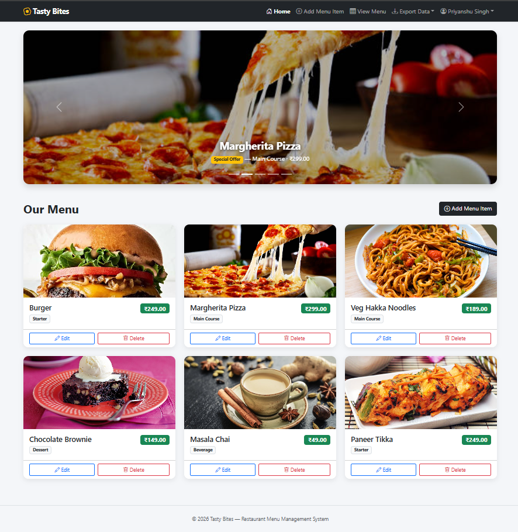
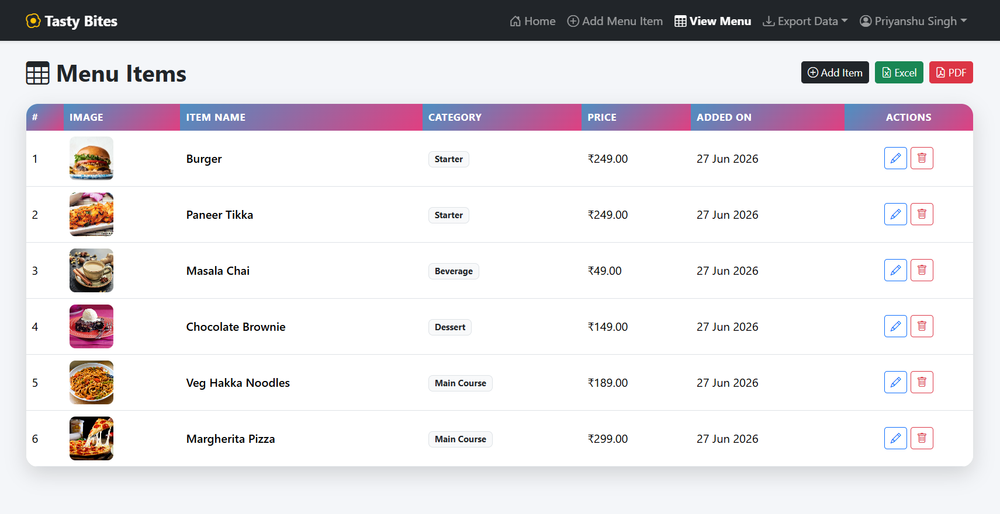
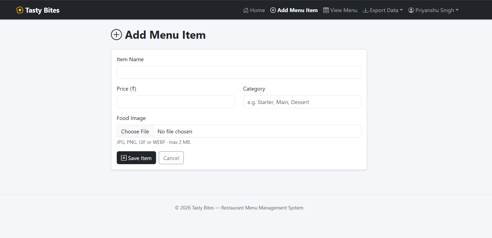
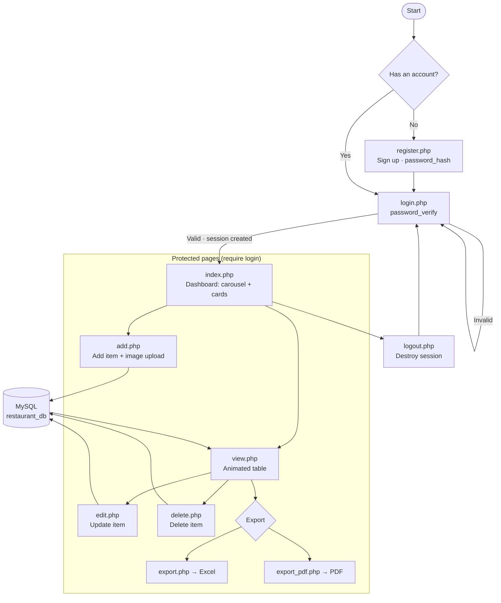

# Restaurant Menu Management System 🍽️

A **PHP + MySQL + Bootstrap 5** mini-project. A restaurant admin can register,
log in (session-secured), and perform full CRUD on menu items with food-image
uploads — browsing them as responsive cards, a Bootstrap carousel, and an
animated-gradient table, and exporting the menu to **Excel or PDF**.

## Tech
- PHP 8 (MySQLi, prepared statements)
- MariaDB / MySQL
- Bootstrap 5 + Bootstrap Icons (CDN)
- Custom CSS gradient animation in `assets/css/style.css`
- FPDF for PDF export
- Fully responsive (desktop → tablet → mobile)

## Screenshots

### 🏠 Dashboard (Home)
The landing page after login. A dark navbar brands the app as **Tasty Bites**,
followed by a **Bootstrap carousel** highlighting a featured dish
("Margherita Pizza" as a special offer). Below, the **"Our Menu"** section shows
every item as a responsive **card** — food image, name, price badge, category,
and per-item **Edit / Delete** buttons.

### 📋 View Menu (Menu List)
The full menu in a table with an **animated gradient header** and row-hover
effects. Columns show **#, Image, Item Name, Category, Price, Added On and
Actions**, with **Edit / Delete** icons per row. The toolbar lets the admin
**Add Item** or export the data to **Excel (.xls)** or **PDF**. The navbar also
carries the logged-in admin's name with a logout dropdown.

### ➕ Add Menu Item
A clean form to create a menu item: **Item Name**, **Price (₹)**, **Category**,
and an optional **Food Image** upload (JPG / PNG / GIF / WEBP, max 2 MB).
**Save Item** inserts the record (the same form is reused for editing).

## Setup (XAMPP)

1. Copy this folder into `C:\xampp\htdocs\` (it already lives in
   `PHP Restaurant Management`).
2. Start **Apache** and **MySQL** from the XAMPP Control Panel.
3. Create the database — either:
   - open **http://localhost/PHP%20Restaurant%20Management/setup.php** once, or
   - import `database.sql` in phpMyAdmin.
4. Visit **http://localhost/PHP%20Restaurant%20Management/login.php**.

### Demo login (created by setup.php)
- **Email:** `admin@demo.com`
- **Password:** `admin123`

You can also create your own account on the Register page.

## Database port note
On this machine port **3306** was already taken by another MySQL instance, so
XAMPP's MariaDB runs on **3307**. That is set in `config/db.php` (`$DB_PORT`).
If your MySQL is on the standard port, change `$DB_PORT` back to `3306`
(and `$DB_HOST` to `localhost`).

## Application Flow

> Every protected page includes `config/auth.php`, which redirects unauthenticated
> visitors back to `login.php`.

## Files
| File | Requirement |
|------|-------------|
| `register.php` | 3.1 Registration (`password_hash`) |
| `login.php` | 3.2 Login (`password_verify`) |
| `config/auth.php` | 3.3 Session handling / page protection |
| `includes/header.php` | 3.4 Navbar & Logout |
| `add.php` / `edit.php` / `delete.php` | 3.5 Menu CRUD |
| `add.php` (`handleImageUpload`) | 3.6 Image upload → `uploads/` |
| `index.php` | 3.7 Card display + 3.9 Bootstrap carousel |
| `view.php` + `assets/css/style.css` | 3.8 Table with animated gradient + hover |
| `export.php` / `export_pdf.php` | 3.10 Excel **and** PDF export |
| `database.sql` / `setup.php` | 5. Database design (`users`, `menu_items`) |

## Security
- Passwords stored as bcrypt hashes (`password_hash` / `password_verify`).
- All queries use MySQLi **prepared statements**.
- Output escaped with `htmlspecialchars` to prevent XSS.
- Uploads validated by extension and size (max 2 MB) and renamed uniquely.
- Internal pages guarded by `config/auth.php`.

> `setup.php` is a convenience for first run — you can delete it afterwards.
